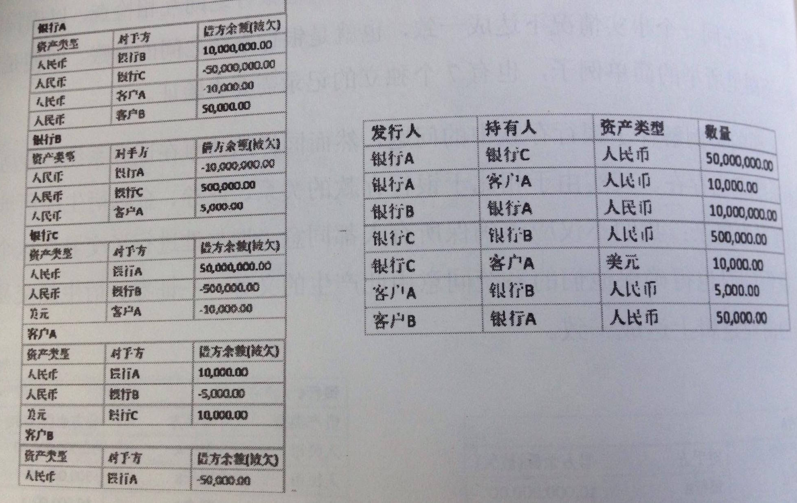

# Chapter 1

# 一、與比特幣的關係


## Bitcoin's Blockchain

> The Times 03 / Jan / 2009 Chancellor on brink of second bailout for banks.
  
> --- "The Times"

#### Blockchain
```
由後往前、有序連接的data structure（公開帳簿）。由一個包含元數據的區塊頭、
以及有序連接的一長串交易（Transaction）組成。
```

####Flat file
```
"flat", which means it has no structure for indexing and there
 are usually no structural relationships between the records.
```
#### LevelDB
```
Google提供的database，用於Bitcoin Core客戶端。
```


####SHA256
```
在每個區塊上加密hash生成hash值。hash值中包含父區塊hash區段，
可透過此值一路溯及創世區塊。
```

### 區塊鏈分叉
```
一個區塊暫時出現多個子區塊，只發生於多個不同區塊同時被不同Miners發現時。
```

### 改動父區塊不易，以維護不可改變性
```
若父區塊的hash改變，則子區塊的父區塊hash區段改變，進而一代代皆需修改，耗費計算量。
因此長區塊鏈的越深層、越穩定，維護不可改變性。（區塊鏈可以想成冰川岩芯樣品）
```

### 區塊頭
```
包含三組區塊元數據（BlockMeta）。
1. 父區塊hash值存放組，和前一塊連接。
2. 難度、timestamp、Nonce，與挖礦競爭相關。
3. Merkle 樹的樹根
```
區塊元數據舉例：

	uint256 hashMerkleRoot;
	unsigned int nTime;
	unsigned int nNonce;

### 區塊鏈共享帳本更新機制
	1. 點對點傳輸的共享ledger
	2. 每個區塊，隨時都有最新同步的總帳備份
	3. 每個區塊都更新對自己有利的信息
	4. 每個節點能選擇receive別的節點發起的信息，request並verify後傳遞
	5. 可選擇不同意、可自己重新發起訊息
	6. 網路的最終目的為，共同同意某一個訊息、並更新到ledger上。
	7. Bitcoin的區塊鏈上以PoW實作
 

### 區塊頭hash值
```
區塊頭通過SHA256兩次hash計算得到的digital fingerprint。
只有區塊頭被用於計算。
```
### Height
```
任一區塊與創世區塊的距離。
```
### 創世區塊
```
1. 創建於2009年，是區塊鏈裡的第一個區塊。
2. 是區塊鏈裡面所有區塊的共同祖先。
3. 每一個節點，都始於至少包含一個區塊的區塊鏈。
```

## Merkle Tree
```
屬於hash二叉樹。每個區塊包含產生於該區塊內的所有transactions，
並為這一連串transactions生成一個Digital Fingerprint。
若遇上奇數個leaves，則最後一個transaction節點複製一份、以構成偶數。
```

## 簡單支付驗證 SPV 
	
	1. 讓client檢驗一筆交易是否在區塊鏈中的技術。
	2. 不需download整條區塊鏈、只需download區塊頭。
	3. SPV client請求一條Merkle branch 來檢驗之。
	

# 二、共識Algorithm


## 拜占庭將軍問題

	distributed node transmission會碰上的共識問題，
	由互不信任的各方構成的網路，但各方又有共同的使命。
	特色：所有國家中的城邦們，都使用著即刻同一版本的「信使即時傳遞的十人圖章表格」 。
	亦即：所有網路上的節點們，都使用著即刻同一版本的總帳。
	城邦 = 節點；信使即時傳遞的十人圖章表格 = 每個節點此刻同意與否的state
	被捨棄、不完整的開戰信息表格 = hash算出的無效值
	發展歷史進攻戰術 = 新生區塊的random元素作為下筆隨機hash的input
## PoW

	1. 工作量證明（Proof of Work），一種共識機制。
	2. 機率問題，誰先生成那筆有效hash值，那個miner就可以先生出一個區塊。
	2. 為訊息傳遞的行為加入成本，以降低傳遞速率。
	3. 加入一個random 元素，保證一個time interval內只有一個城邦、有權傳遞訊息
	4. 替代方案：PoS，通過每一筆交易銷毀的Coindays實現此服務驗證。
### Random 元素的作法
	元素丟進去、讓節點進行隨機hash算完之後，獲得64bit的字符串（hash值）。
	只有前13個字符是0的字串，能被bitcoin blockchain系統接收，成爲PoW。
	
### 新的區塊如何產生？
	1. 某個城邦（節點）發現一行有效的64bit hash值
	2. 把同時所有接收到的訊息、並附上自己的訊息、簽名圖章，向網路各處重新廣播
	3. 其他所有城邦們，接收並驗證這筆hash值
	4. 產生一個新區塊
	5. 更新共享帳本
	6. 把新的帳本作為新的random元素
### 時間間隔的刻意設定
	1. 每次成功找到有效hash值，直至區塊鏈更新的interval約為10分鐘
	2. 當區塊鏈更新、並在網路同步後，之前10分鐘新進的新交易也被更新同步
### 圖章
	1. 個人向網路輸入一筆交易時，利用請求端的private key與接收端開放取用的public key，為這筆交易簽章。
	cf.城邦向網路輸入一筆協議時，利用請求端的private key與接收端開放取用的public key，為這筆開戰協議簽章。

## PoS(Proof of Stake) 與 DPoS

### DPoS
	1. 股份授權證明機制，是新的保障加密貨幣網路安全的方法。
	2. 持股人掌控大局、使系統中心化。
### PoW 與 PoS的安全性比較
	1. 2016年三月，每個bitcoin價值約418USD，每年產出5萬個區塊，總市值約64億USD
	2. 每個block支付miners 25個BTC。
	3. 若網路價值增加，則PoS更穩定而安全。
	4. PoS是比誰拳頭大（持股人）、錢多資源多的miner，就可以先挖出block。
	5. PoW的部分，若bitcoin價值不變，當miner獎勵下降50%，網路安全也會下降，總市值需增至128億USD、難度調整後，才能維持原本級別的安全。
	6. DPoS股份投票的方式決定由誰生產區塊、PoW電腦機率運算決定誰是下一個區塊生產者

### 雙重支付攻擊
	1. 攻擊者必須在產出6個區塊的同時秘密產出7個區塊
	2. 攻擊者累積大量Coindays，每年最多執行一次。
	3. 若金額較大時、讓blockchain等待較長時間，則可以降低雙重支付的可能性。
	
### 關於Delegate
	1. Bitcoin的PoW每個人都是Miner
	2. GCoin只有部分人們有權挖礦，類似PoS的Delegate制度
	3. 不是Delegate的人，投贊成票給自己挑的Delegate
	4. Deleates所得贊成票的數量，就是股份

## 投票Algorithm

	略	

# 三、區塊鏈與可信任運算


## 多重簽章

	1. Multi-signature，對應到 Single-signature
	2. public-key cryptography
	3. 收受Bitcoin的公司不敢讓單一員工全權負責transaction，密碼不會在任一人手上
	4. 每筆transaction需要 > 1 key進行授權
	5. 以互不信任基礎，建立互相制衡關係

## DAO 分佈式自治組織

	1. Decentralized Autonomous Organization
	2. 開放式的創投基金會
	3. 專門跑encoding smart contracts。
	4. 以Ethereum搭建
	5. 將會投資使用blockchain技術的各種share eco. 產品。
	6. DAO不是人力管理，而是程式碼自動執行，像是大型綜合的智慧合約。
	7. 投資者以虛擬貨幣「以太幣（ETH）」交換稱為「DAO token」的公司股份
	8. 跟比特幣一樣，所有交易皆被公開在網站上（如以太坊）供瀏覽。
	9. The DAO就像其他的傳統創投基金，以營利為導向

# 四、分佈式帳本

## Triple Entry Accounting

	1. 傳統記帳方式為複式記帳法：
	（借方、貸方、資產、負債、資產負債表...etc）
	2. 三重記帳法原理：付款人A, 收款人 B, 見證人I
	STEP 1. A把錢給B
	STEP 2. B收到錢後，生成收據R1返還給A
	STEP 3. A收到R1後，加上自己的簽名成為R2，給I
	STEP 4. I把R2複製兩份、一份給B一份I自己留存
	
## 分佈式記帳法

	1. 將triple法的見證人I替換成網路上所有其他節點
	2. 將交易的驗證方式，從第三個節點擴到無數個節點
	3. 解決過去「銀行系統之間的對帳」的麻煩



> 左圖為各家銀行原本作法，右邊為全球共享帳本做法。  
> 原本銀行之間要互相檢查，存款者還需要相信銀行還得起、且銀行會記得。  
> 全球共享帳本做法，銀行之間互相檢查就直接在同一表格中比對，存款者也絕對可相信此共享組織（因為只有唯一一個）。  

不用擔心單一銀行壟斷、利用兩個修改：  
	1. 在大規模內複製帳本，目標使每一個銀行都有其他n-1個銀行有他的副本
	2. 每個個體都有所貢獻、讓銀行與顧客，全體同時負責維護帳本的安全。	
## 智能合約
	除了模仿各方之間的餘額，想進一步記錄其他資產與協議。